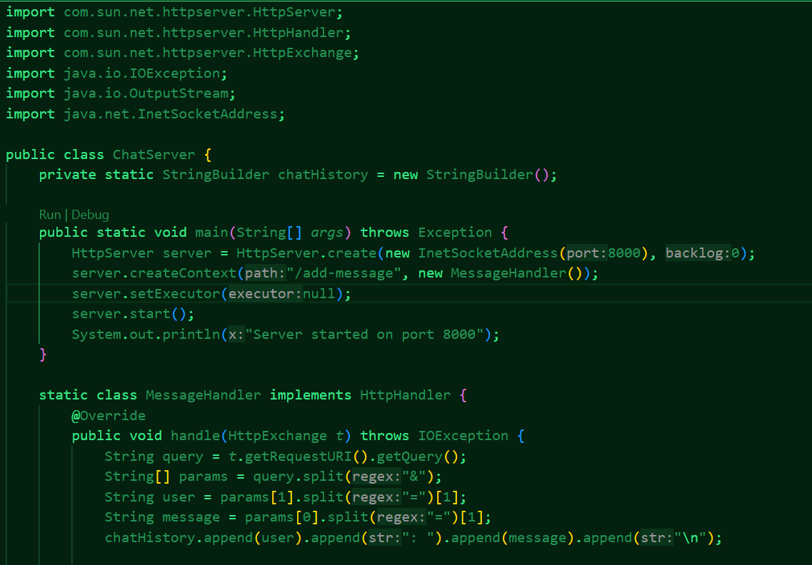
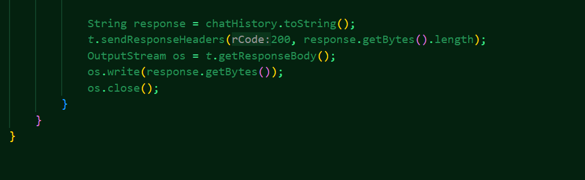
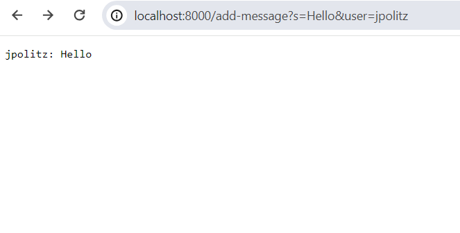
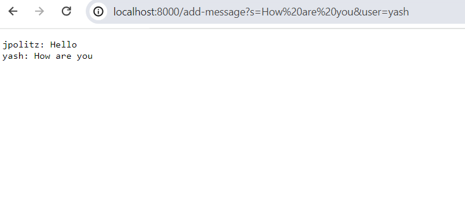

# Lab Report 2
## Server code 

## First Screenshot

> For this first screenshot the method that is called is the `handle` method which is derived from the `MessageHandler` class. The argument that is passed through the handle method is the `HttpExchange t` argument which has the details of the request and the relevant field before the request is made is the `chatHistory` field which is initially empty. The field `chatHistory` has its values changed by this specific request as it was initially empty and after this request it will contain the message "jpolitz: Hello\n".

## Second Screenshot

> For the second screenshot the same method as the one utilized above is called again which is the `handle` method that is again derived from the `MessageHandler` class. The argument that is passed this time is the `HttpExchange t` argument which now contains the new request made at the end of the server's url. The relevant field before this request is made is the `chatHistory` field which before the request is made contains the "jpolitz: Hello\n" string in it. After the request is made the relevant field will now contain the aforementioned string as well as "yash: How are you\n".

## Absolute path to 
