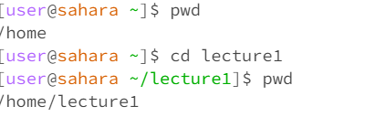
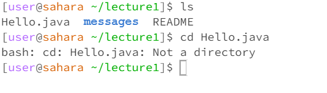
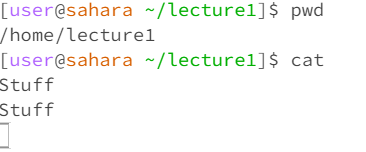
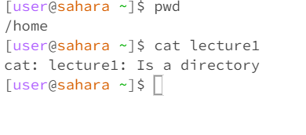
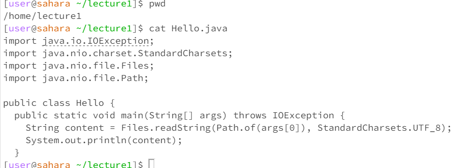

# Lab Report 1
---
## cd with no argument 

> The working directory when I entered the command was `/home/lecture1`, and when I entered the command `cd` with no argument it returned to the directory previous to the one I was currently in which was `/home`. This is due to the fact that `cd` is a command that changes directories and when no arguments are given it returns to a previous directory meaning that this was not an error.
## cd with a directory as an argument
 
> The working directory when I entered the command was `/home`, and when I entered the command `cd` with `lecture1` directory as an argument it changed the working directory to `/home/lecture1`. This is due to `cd` being a command that changes directories and is not an error.
## cd with a file as an argument 

> The working directory when I entered the command was `/home/lecture1`, and when I entered the command `cd` with the file `Hello.java` as an argument it stated that it could not process my request due to the file not being directory which is an error.
## ls with no argument

> The working directory when I entered the command was `/home/lecture1`, and when I entered the command `ls` with no argument it listed out the files in the directory `/home/lecture1`. This is due to the fact that the `ls` command reads out the files in a directory and it is not an error.
## ls with a directory as an argument

> The working directory when I entered the command was `/home`, and when I entered the command ls with the directory `lecture1` as an argument it returned the files in that directory. This is due to `ls` being a command that reads out the files within a directory and is not an error.
## ls with a file as an argument 

>The working directory when I entered the command was `/home`, and when I entered the command `ls` with the file `Hello.java` as an argument it simply returned the name of the file. This is because `ls` reads out all of the files in a directory and a file not being a directory has only one thing ls can return and this is not an error.
## cat with no argument

> The working directory when I entered the command was `/home/lecture1`, and when I entered the command `cat` with no argument it returned nothing until I typed something directly which it then read out. This is due to cat being a command that reads out text and files it is given and when given nothing it returns nothing and this is not an error.
## cat with a directory as an argument 

> The working directory when I entered the command was `/home`, and when I entered the command `cat` with the directory `lecture1` as an argument it returned the message `cat: lecture1: Is a directory`. This is because `cat` is a command that reads out files and text and a directory not being that caused an output that is an error.
## cat with a file as an argument

> The working directory when I entered the command was `/home/lecture1`, and when I entered the file `Hello.java` in as an argument it returned the contents of that file. This is because `cat` reads out files that it is given as input and is not an error.  
