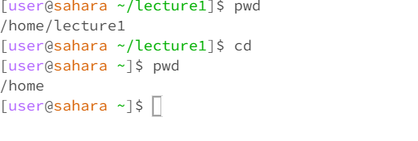

# Lab Report 1
---
## cd with no argument 

> The working directory when I entered the command was /home/lecture1, and when I entered the command with no argument it returned to the directory previous to the one I was currently in which was /home. This is due to the fact that cd is a command that changes directories and when no arguments are given it returns to a previous directory meaning that this was not an error.
## cd with a directory as an argument
 
> The working directory when I entered the command was /home, and when I entered the command cd with lecture1 directory as an argument it changed the working directory to lecture1. This is due to cd being a command that changes directories and is not an error.
## cd with a file as an argument 

> The working directory when I entered in the command was /home/lecture1, and when I entered in the command with a file as an argument it stated that it could not process my request due to the file not being directory which is an error.
## ls with no argument

> The working directory when I entered in the command was /home/lecture1, and when I entered the command it listed out the files in the directory lecture1. This is due to the fact that the ls command reads out the files in a directory and it is not an error.
## ls with a directory as an argument

> The working directory when I entered the command was 
